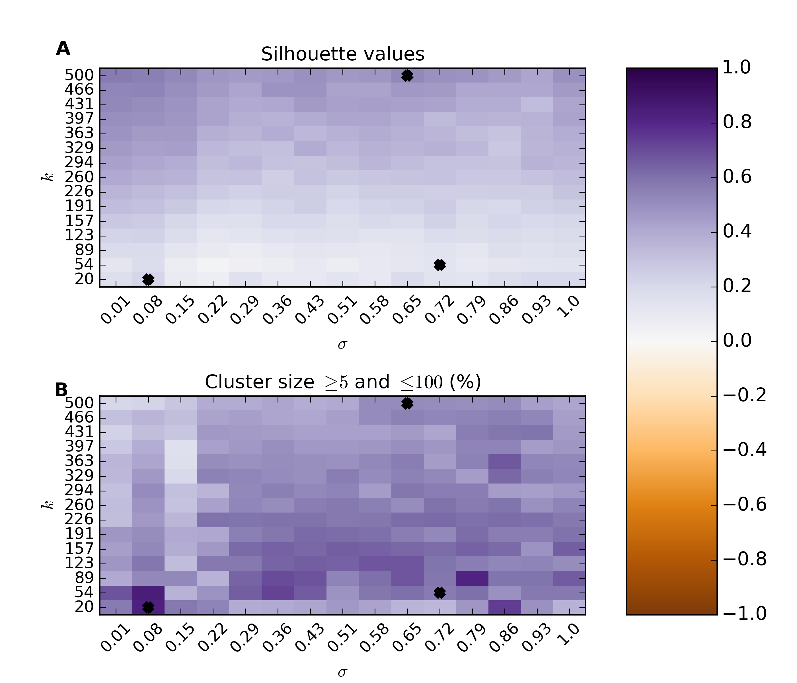

.. pipeline example

Gene set analysis
======================

The procedure in this tutorial example to carry out gene set analysis using ``htsint`` is composed of three main steps. 

   #. Gene set generation
   #. Gene set testing
   #. Gene set visualization

This example takes anywhere from 30 minutes to several hours on a modern desktop computer.  To run a shorter example use the ``molecular_function`` domain of the Gene Ontology.  The code used for gene set generation in this document is available as a script for convenience.

   * :download:`gsa-example.py`

(1) Gene set generation
----------------------------

The basic process involves integrating Gene Ontology [Ashburner00]_ information from one or more taxa to infer functional distances between genes.  These distances are then used to cluster the genes in a specified list.  These genes are any groups of genes that you might want to cluster.  For example, you may use the genes in a large pathway or all genes from an RNA-Seq experiment, as is the case in this example.

Create a term graph
^^^^^^^^^^^^^^^^^^^^^^^^^^

First make the necessary imports.

   >>> import time,os,re
   >>> from htsint import GeneOntology,TermDistances,GeneDistances,GeneSetCollection
   >>> from htsint.stats import SpectralCluster, SpectralClusterParamSearch, SpectralClusterResults
   >>> from htsint.blast import BlastMapper

Then specify an output directory along with a GO aspect with an abbreviation.  The valid GO aspects are: 'biological_process', 'molecular_function' and 'cellular_component'.

   >>> homeDir = os.path.join(".","demo")
   >>> if not os.path.isdir(homeDir):
   >>>  os.mkdir(homeDir)

   >>> aspect = 'biological_process' 
   >>> _aspect = 'bp'   
   
Because genes and their ontology terms will be loaded multiple times fetch the annotations only once then save the dictionaries.

   >>> go = GeneOntology(["8364","8355"],useIea=False,aspect=aspect)
   >>> termsPath = os.path.join(homeDir,"go-terms.pickle")
   >>> graphPath = os.path.join(homeDir,"go-graph.pickle")
   >>> go.create_dicts(termsPath)
   >>> gene2go,go2gene = go.load_dicts(termsPath)   
   >>> print("%s genes have at least one annotation"%(len(gene2go.keys())))
   1597 genes have at least one annotation
   >>> print("Term graph for with %s nodes successfully created."%(len(G.nodes())))
   total distances to evaluate: 1219141.0

Create the graph of term-term relationships.
   
   >>> G = go.create_gograph(termsPath=termsPath,graphPath=graphPath)
   Term graph for with 15719 nodes successfully created.

Calculate term distances
^^^^^^^^^^^^^^^^^^^^^^^^^^^^^^

Ideally, this step is carried out in a cluster environment and if you are using `Grid Engine <http://gridscheduler.sourceforge.net>`_ then there are built-in convenience methods.  Whether you are in a high performance environment or on a single machine the initialization is the same. 

   >>> termDistancePath = os.path.join(homeDir,"term-distances.npy")
   >>> td = TermDistances(termsPath,graphPath)
   >>> print("total distances to evaluate: %s"%td.totalDistances)
   total distances to evaluate: 1219141.0
    
Using Grid Engine:
"""""""""""""""""""""

   >>> cpus = 60
   >>> td.create_scripts('youremail@somewhere.edu',cpus=cpus)
   >>> td.submit()

Before you submit you can check in the ``htsint-tmp`` directory that was created in the current working directory to ensure the Bash scripts work for your computing environment.  The results are then assembled into a single file.

   >>> from htsint import AssembleDistances
   >>> ad = AssembleDistances(termsPath,resultsPath=termDistancePath)
   >>> ad.run(cpus=cpus)

Using single machine
""""""""""""""""""""""

   >>> td.run_with_multiprocessing(termDistancePath,cpus=16)

This is the most computationally expensive step in the pipeline so for lists with more than a few thousand genes this calculation becomes difficult outside of a cluster environment.  Using 8 cores on a single machine the previous command finished in XX:XX:XX (hh:mm:ss).

Calculate gene distances
^^^^^^^^^^^^^^^^^^^^^^^^^^^

With the term-term distances stored in the distance file we can map the gene-gene distances.

   >>> geneDistancePath = os.path.join(homeDir,"gene-distances.csv")
   >>> gd = GeneDistances(termsPath,termDistancePath,outFile=geneDistancePath)
   >>> gd.run()

Spectral Clustering
^^^^^^^^^^^^^^^^^^^^^^^^^

With the gene-gene distances a number of unsupervised clustering algorithms can be used here.  Because spectral clustering is appropriate for networks we have implemented two algorithms as part of ``htsint``.  There is a bandwidth parameter :math:`\sigma` and a parameter for the number of clusters `k` that need to be given.

Parameter estimation [optional]
"""""""""""""""""""""""""""""""""

   >>> silvalFile = re.sub("\.csv","-scparams-sv.csv",geneDistancePath)
   >>> clustersFile = re.sub("\.csv","-scparams-cl.csv",geneDistancePath)
   >>> scps = SpectralClusterParamSearch(geneDistancePath,dtype='distance')
   >>> scps.run(chunks=15)

Plot the parameter search 

   >>> psFigureFile = os.path.join(homeDir,"param-scan-%s.png"%(_aspect))
   >>> scr = SpectralClusterResults(silvalFile,clustersFile)
   >>> scr.plot(figName=psFigureFile)

Ideally, we are looking for values of :math:`\sigma` and `k` that maximize our silhouette value, while at the same time maximize the number of clusters that fall into a reasonable size range.  The size range can be set with the ``threshMin`` and ``threshMax`` arguments.  It helps result interpretation if the specified range can be reasonably investigated through visualization.  The top panel shows the average silhouette value for the clustering results over a grid of possible parameter values. For the same grid the bottom panel illustrates the percentage of total genes that fall into clusters of the desired size.  There is usually a trade-off between high silhouette values and the reasonably sized clusters.  The top three optimal values are marked on the plots.  For this example the parameters are maximized at :math:`k=123` and :math:`\sigma=0.08`.  It is worth noting that strongly associated clusters tend to remain mostly intact over a wide range of parameter values.  In the script version of this example this section the parameter estimation is commented out to minimize compute time.

Run spectral clustering
"""""""""""""""""""""""""""""""""

There are two implementations of spectral clustering available through the SpectralCluster class.  If the argument ``sk`` is ``None`` then the original algorithm proposed by Andrew Ng *et al*. is used [Ng01]_.  Alternatively, a self-tuning version of this algorithm was proposed by Zelnik-Manor and Perona that uses a different :math:`\sigma` around each neighborhood.  The neighborhood size is controlled by the parameter ``sk`` as discussed in the manuscript [Zelnik-Manor04]_.  For smaller networks the self-tuning method gives reasonable results, however for larger networks the grid parameter search seems to provide more biologically intuitive clusters.

   >>> from htsint.stats import SpectralCluster
   >>> k = 123
   >>> sigma = 0.08
   >>> sc = SpectralCluster(geneDistancePath,dtype='distance')
   >>> sc.run(k,sk=None,sigma=sigma,verbose=True)
   >>> sc.save(labelsPath=labelsPath)

Map genes to transcripts and save gene sets
^^^^^^^^^^^^^^^^^^^^^^^^^^^^^^^^^^^^^^^^^^^^^^

Run :doc:`BLAST and create a summarized blast map <blast>`.  To save time in this tutorial we provide an example summary file below.

   * :download:`blast-parsed-summary.csv <blast-parsed-summary.csv>`

   Load the file.

   >>> from htsint.blast import BlastMapper
   >>> bm = BlastMapper()
   >>> bmap = bm.load_summary('blast-parsed-summary.csv',best=False)

Then we can constrain the gene set size in terms of the number of transcripts by setting the ``transcriptMin`` and ``transcriptMax`` arguments.

   >>> from htsint import GeneSetCollection
   >>> transcriptMin,transcriptMax = 9,1000
   >>> gsFile = os.path.join(homeDir,"%s.gmt"%(_aspect))

   >>> gsc = GeneSetCollection(labelsPath,gene2go)
   >>> gsc.write(blastMap=bmap,transcriptMin=transcriptMin,transcriptMax=transcriptMax,outFile=gsFile)

The class ``GeneSetCollection`` will create two files and the ``write`` method can be used to create these files for different assemblies assuming the BLAST mapper is appropriate.  The file name specified by gsFile will specify where to write `GMT formatted <http://www.broadinstitute.org/cancer/software/gsea/wiki/index.php/Data_formats#GMT:_Gene_Matrix_Transposed_file_format_.28.2A.gmt.29>`_ file.  For convenience and visualization another file (in csv format) with the same  name base will be created to store the gene to transcript mappings.  In this case ``./demo/bp.gmt`` and ``./demo/bp.csv`` will be created.

(2) Gene set testing (GSA)
---------------------------

There are a number of packages available to run Gene set analysis.  We use in this example the `GSA R package <http://cran.r-project.org/web/packages/GSA/GSA.pdf>`_.  Download and run the following script.

   :download:`run-gsa.R`

Before you can run the R script a count file (``deseq-samples.csv``) containing transformed counts needs to be in the current working directory.  If you followed the :doc:`gene expression tutorial <deseq-example>` then the file should be present.  Otherwise, download the :download:`raw-counts.csv <../raw-counts.csv>` and  :download:`run-deseq.R <../run-deseq.R>` scripts and run the following first. 

To run the example you use:

   .. code-block:: bash

      ~$ Rscript run-deseq.R raw-counts.csv

Once you have run DESeq the transformed counts are available and GSA can be run.

   .. code-block:: bash

      ~$ Rscript run-gsa.R bp

Inside of the demo directory a file names ``geneset-results.csv`` will be created identifing the gene sets with FDR values less than 0.5.  Edit the script and refer to the documentation to modify the file to fit you experimental setting.

(3) Visualizing gene sets
----------------------------

First, we need to specify a few paths to files that were created duing the gene set generation process.  Then using the object ``GeneSet``, a network visualization that makes use of `NetworkX <http://networkx.github.io/>`_ can be made for any arbitrary gene set.

   >>> import numpy as np
   >>> from htsint import GeneSet
   >>> distMat = np.load(os.path.join(".","demo","term-distances.npy"))
   >>> genesetFile = os.path.join(".","demo","bp.csv")
   >>> termsPath = os.path.join(".","demo","go-terms.pickle")
   >>> gsets = GeneSet()
   >>> gsets.load_geneset(genesetFile,termsPath,distMat)
   >>> genesetId = 'gs-60'
   >>> gsets.draw_figure(genesetId,layout='spring',name='%s.png'%(genesetId),percentile=25)

.. figure:: ./demo/gs-60.png
   :scale: 15%
   :align: center
   :alt: example gene set
   :figclass: align-center
