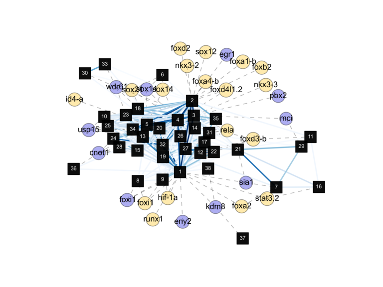

.. main file for htsint documentation

hts-integrate
=====================================================

.. INCLUDE ../example_web.png 

HTSInt is a Python package used to create gene sets for the study of high-throughput sequencing data.  The target audience for HTSInt are developers that piece together high-throughput sequencing (HTS) pipelines.  The software in its current form is an API library and because HTS pipelines have different goals with many varied tasks required to achieve these goals, a flexible library in a scripting language commonly used in bioinformatics was selected.  One important aspect of this project is to provide both abstracted functions for non-Python programmers as well as convenient means to enable a higher levels of customization.

Features
------------

   1. The data are locally stored and maintained  in a :doc:`database <database>`
   2. The database is fully accessible and modifiable through `SQLAlchemy <http://www.sqlalchemy.org>`_.  
   3. Visualization tools like heatmaps and interaction networks included
   4. The user has complete control over the information used to generate gene sets
   5. Easy to follow examples that require only a basic knowledge of Python
 
General contents:
-----------------------

.. toctree::
   :maxdepth: 1

   install
   database

Tutorials:
---------------------

.. toctree::
   :maxdepth: 1

   Database cookbook <database-cookbook>
   Using BLAST <blast>
   Gene Ontology annotation fetching <annotation-fetching>
   Gene level differential expression <deseq-example>
   Gene set analysis example <gsa-example>
   References <references>
