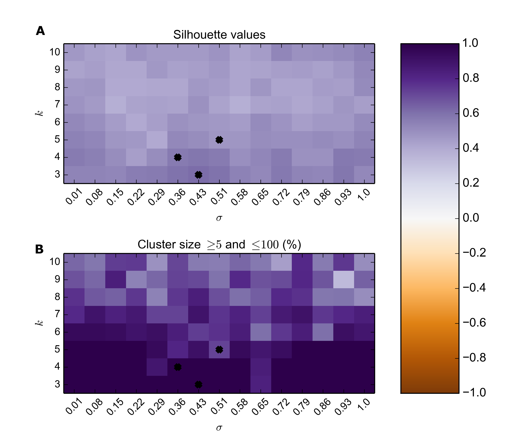

.. pipeline example

Pathway example
======================

Lets start with a pathway downloaded from the KEGG database.

  * :download:`hsa00860.txt`

The Python code in this example is available as a script.
    
  * :download:`pathway-example.py`    

First lets define a parsing function for the KEGG formatted pathways file.

.. code-block:: python

  def get_genes(pathway):
      fid = open(os.path.join(".",pathway+".txt"),'r')
      isGene = False
      gene2symbol = {}
      for linja in fid:
          linja = linja[:-1]
          if re.search("^GENE",linja):
              isGene = True
          elif re.search("^[A-Z]+",linja):
              isGene = False             
          if isGene:
              geneIds = linja.split(";")[0]
              _geneIds = [re.sub("\s+","",gi) for gi in geneIds.split("  ")]
              geneIds = []
              for gid in _geneIds:
                  if len(gid) > 0 and gid != 'GENE':
                      geneIds.append(gid)
              if len(geneIds) != 2:
                  print("...%s"%str(geneIds))
                  raise Exception("Could not parse gene names")
              ncbiId,symbol = geneIds
              gene2symbol[ncbiId] = symbol            
     fid.close()
     return gene2symbol

Extract the genes into a list

>>> pathwayFile = "hsa00860.txt"
>>> pathway = pathwayFile[:-4]
>>> geneList = get_genes(pathway)
>>> print(geneList.items()[:3])
[('7363', 'UGT2B4'), ('212', 'ALAS2'), ('210', 'ALAD')]

Specify a location for the analysis files.

>>> gsaDir = os.path.join(".","gsa-path")
>>> if not os.path.exists(gsaDir):
>>>    os.mkdir(gsaDir)

Make imports and specify variables

>>> from htsint import GeneOntology,TermDistances,GeneDistances
>>> useIea = True
>>> aspect = "biological_process"
>>> _aspect = 'bp'
>>> taxaList = ['9606']
>>> go = GeneOntology(taxaList,useIea=useIea,aspect=aspect)
>>> termsPath = os.path.join(gsaDir,"go-terms-%s.pickle"%(_aspect))
>>> graphPath = os.path.join(gsaDir,"go-graph-%s.pickle"%(_aspect))

By default ``htsint`` works at the genome level so to get term distances with respect to a subset of genes we need to specify an `accepted` list.  The rest of the process is the same as was shown in the gsa example.

Create the gene-term dictionaries

>>> geneIds = geneList.keys()
>>> go.create_dicts(termsPath,accepted=geneIds)
>>> gene2go,go2gene = go.load_dicts(termsPath)
>>> print("pathway genes with terms: %s/%s"%(len(gene2go.keys()),len(geneIds)))

Create the term specific graph

>>> G = go.create_gograph(termsPath=termsPath,graphPath=graphPath)
>>> print("Term graph for with %s nodes successfully created."%(len(G.nodes())))

Calculate the distances between terms

>>> termDistancePath = os.path.join(gsaDir,"term-distances-%s.npy"%(_aspect))
>>> td = TermDistances(termsPath,graphPath)
>>> print("total distances to evaluate: %s"%td.totalDistances)
>>> td.run_with_multiprocessing(termDistancePath,cpus=4)

Map the term distances into gene space

>>> geneDistancePath = os.path.join(gsaDir,"gene-distances-%s.csv"%(_aspect))
>>> gd = GeneDistances(termsPath,termDistancePath,outFile=geneDistancePath)
>>> gd.run()

Run the parameter search for spectral clustering

>>> silvalFile = re.sub("\.csv","-scparams-sv.csv",geneDistancePath)
>>> clustersFile = re.sub("\.csv","-scparams-cl.csv",geneDistancePath)
>>> scps = SpectralClusterParamSearch(geneDistancePath,dtype='distance')
>>> scps.run(chunks=5,kRange=range(3,11))

Plot the parameter search

>>> psFigureFile = os.path.join(gsaDir,"param-scan-%s.png"%(_aspect))
>>> scr = SpectralClusterResults(silvalFile,clustersFile)
>>> scr.plot(figName=psFigureFile)

Run spectral clustering with selected parameters

>>> k = 3
>>> sigma = 0.43
>>> labelsPath = os.path.join(gsaDir,"sc-labels-%s.csv"%(_aspect))
>>> sc = SpectralCluster(geneDistancePath,dtype='distance')
>>> sc.run(k,sk=None,sigma=sigma,verbose=True)
>>> sc.save(labelsPath=labelsPath)

The genes and their labels are saved in `labelsPath`.
